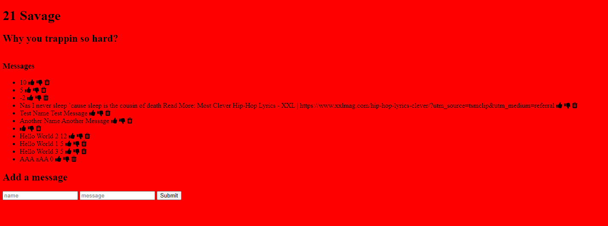

### 21 21 21 Message's!

#### 🎤Project: Rap lyrics

## Examples

### About this project:

This is my savage message board, create update & delete messages/rap lyrics!

If you want to see more of my work, feel free to explore my portfolio! [GitHub](https://github.com/Michaelariasdls).

#### How to run instructions

## Installation

1. Clone repo
2. run `npm install`

## Usage

1. run `npm run savage`
2. Navigate to `localhost:3000`

## How It's Made

Tech Stack: JavaScript, Node.js. Express.js, EJS, MongoDB

This CRUD application uses the tech stack above, allowing you to upvote, downvote & delete messages

## Lessons Learned
I learned alot building this CRUD application, i learned how exsactly the front end communicates with the server side back-end utilizing the database i created.

### Backend
MongoDB Atlas https://www.mongodb.com/atlas/database